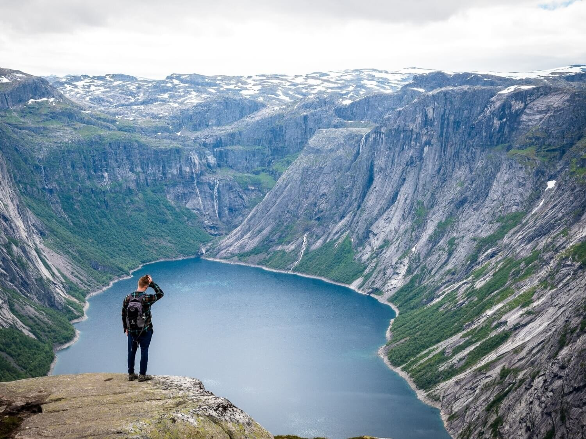
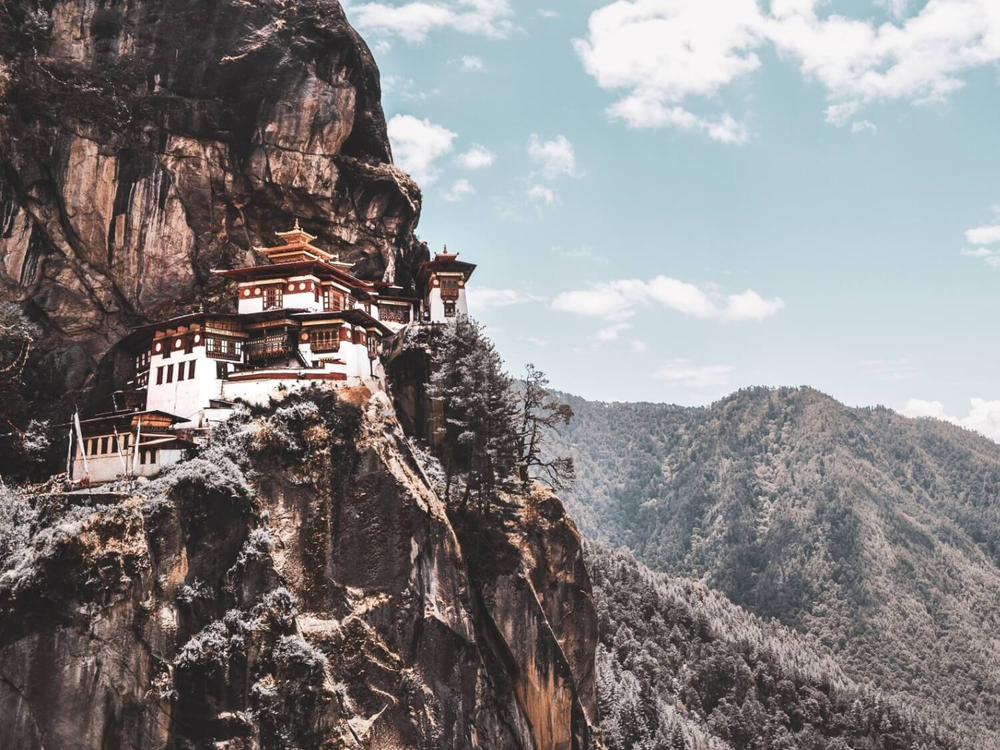

### Nếu bạn có chút máu mạo hiểm và yêu thích gần gũi với thiên nhiên, thì hãy thử đi tour hiking hoặc trekking, bạn sẽ có trải nghiệm nhớ đời.
Tuy nhiên, khái niệm “Hiking” và “Trekking” cũng còn khá mới với một số bạn ở Việt Nam, và ngay cả hai hoạt động dã ngoại này có một số điểm giống và cũng khác.
Hiểu sự khác nhau giữa “hiking” và “trekking” để giúp bạn chọn ra một hành trình phù hợp.
Thế sự khác nhau là gì? Hãy đọc thêm nhé.



**Hiking là gì**

Nói một cách đơn giản, hiking là một hoạt động giải trí (hoạt động outdoor) bằng cách đi bộ ngắm cảnh trên đường mòn được bảo trì và đầy đủ ký hiệu. 
- Độ khó: Thường hiking có độ khó trung bình và không quá nhọc sức như trekking.
- Địa hình: Từ những ngọn đồi thoai thoải đến dốc và qua những khu rừng dốc.
- Thời gian: Khoảng vài tiếng, đến một ngày và thường thì bạn không phải mang vác nặng hay qua đêm ngoài trời.

**Hiking giành cho ai**

Nói một cách đơn giản, hiking là một hoạt động giải trí (hoạt động outdoor) bằng cách đi bộ ngắm cảnh trên đường mòn được bảo trì và đầy đủ ký hiệu. 
- Bạn muốn hoạt động ngoài trời để máu lưu thông, tim đập nhanh hơn nhưng không khiến bạn vượt quá xa sức chịu đựng của cơ thể. 
- Đi bộ trong ngày (hoặc cuối tuần) và có thể lên xuống đồi, xuyên rừng có thể đi trong thời tiết mưa, mưa đá hay nắng.
- Hiking đòi hỏi thể lực không quá cao, ít hơn là chuyến trekking, nhưng bạn vẫn phải chuẩn bị thể lực ở mức độ cơ bản.

**Đi Hiking thì như thế nào**

Một chuyến hiking (tour hiking) là hoạt động giúp bạn gần với thiên nhiên, môi trường nơi bạn đến. Thường thức dậy vào sáng sớm, hít khí trời trong lành, chụp những bức ảnh sống ảo và đồng hành cùng với những người bạn cũng yêu thiên nhiên (giống bạn vậy đó).

Tùy vào từng địa điểm, thi thoảng bạn cũng phải mang theo lều và giúp nhóm lửa nấu ăn. Những lúc khác thì nghỉ ở lán trại – tùy thuộc vào từng tour và cung hiking.

Cung Hiking trên thế giới phải thử
Hầu như ai cũng có những địa điểm ưa thích để đi hiking. Nhưng có lẽ những cung hiking nổi tiếng trên thế giới nên thử
```Tiger’s Nest, Bhutan```


Hầu hết mọi người đi du lịch đến Bhutan đều thử hike leo dọc vách núi để thăm quan tu viện phật giáo Tigers Nest.
Nằm cheo leo ở độ cao 900m so với mặt đất, cung đường leo này khá dốc nhưng cảnh đẹp thì hoàn toàn bõ công sức.
Khoảng cách: 3.25 kilometres (Lên và xuống)
Thời gian: Mất hai tiếng để lên đến đỉnh, tuy nhiên cứ thong thả từ 5-7 iếng cho toàn bộ hành trình. 
```Tongariro Alpine Crossing, New Zealand```

Một trong những cung hiking ngắn ngày đẹp nhất ở New Zealand, địa hình núi lửa độc đáo và phong cảnh đẹp tuyệt vời. Nếu bạn muốn một cung ngắn ngày mà phong cảnh thay đổi liên tục, đây là lựa chọn hoàn hảo.

Khoảng cách: 19.5 kilometres (Hai chiều)

Thời gian: Từ 6 đến 8 tiếng

Trolltunga, Norway
Nếu bạn đã từng thấy những tấm hình sống ảo ai đó đang chổng ngược ngay vách đá cheo leo trên hồ nước xanh, đó hẳn là ở Trolltunga.

Vừa đẹp và tạo cảm giác hồi hộp, cung hike này vừa không những khó quên vì cảnh đẹp mà còn vì trải nghiệm hồi hộp giành cho ai ưa mạo hiểm.

Khoảng cách: 23 kilometres (hai chiều)

Thời gian: Từ 8 đến 10 tiếng

Torres del Paine Lookout, Chile

Cung hiking này sẽ khiến bạn muốn leo lại lần nữa. Điểm nổi bật của hành trình này là tòa núi granite Andean sừng sững trước mặt. Và rất nhiều cơ hội để chụp hình sống ảo.

Khoảng cách: 19 kilometres (Hai chiều)

Thời gian: Từ bốn đến sáu tiếng, tuy nhiên, cũng khá phụ thuộc vào thời tiết thay đổi

Faulhornweg Bernese, Switzerland

Một trong những địa điểm hiking kinh điển của thế giới, cung Faulhornweg hike đưa bạn tới những đỉnh núi khá nổi bật trên thế giới. Cung đường kịch tính, với những đồng cỏ tuyệt đẹp, những bông hoa dại trên núi cao, và dĩ nhiên, là Faulhorn ở độ cao 2,680m trên mực nước biển.

Khoảng cách: 15 kilometres (Hai chiều)

Thời gian: Từ 5 đến 6 tiếng.

CẦN BIẾT GÌ TRƯỚC KHI ĐI HIKING?
Trước khi đi hiking, cần trang bị những kiến thức để không bỡ ngỡ. nên tìm hiểu nơi đến và chắc rằng mình đủ sức khỏe và trang thiết bị cho hành trình. 

Kiểm tra trang thiết bị. Tốt nhất là kiểm tra trang thiết bị hoạt động tốt trước đi, tránh để vật dụng hỏng hóc không xài được. Như là giày hiking, mang ra để chạy thử ngoài sân hay hàng xóm.

Tránh đồ vật liệu cotton. Chọn loại nhanh khô, thoáng mồ hôi sẽ giúp bạn cảm thấy thoải mái nếu trời nóng quá hoặc lỡ mưa.

Mang theo nước và đồ ăn: Hầu hết mọi người cần ít nhất nửa lít nước trong khoảng 2 tiếng đi. Đồ ăn, bạn có thể sẽ cần khoảng từ 300g-500g đồ ăn, cho một ngày và đồ ăn vặt snacks. 

Tôn trọng thiên nhiên. Và cả con người, hãy nhớ là bạn là du khách. Không xả rác, giữ thái độ lịch sự (hãy mỉm cười và chào những người trên đường), và đừng làm gì ảnh hưởng đến thiên nhiên.

Thử giày hiking hoặc giày chạy trail. Loại giày trekking cũng tốt nhưng tương đối nặng, tùy thuộc vào độ dài của cung hiking nhiều khi nó nặng làm bạn mệt thêm. Giày chạy trail ngày càng phổ biến đối với nhiều hikers.

Chia sẻ kế hoạch của bạn. Và điều này còn quan trọng hơn nếu bạn không đi cùng nhóm hay đi tour, luôn luôn chia sẻ kế hoạch của mình để phòng trường hợp rủi ro. Hãy cho người thân biết khi nào bắt đầu và khi nào kết thúc chương trình. An toàn là trên hết.

CHUẨN BỊ GÌ KHI ĐI HIKING?
Hoạt động hiking đòi hỏi chuẩn bị kỹ hơn hoạt động thăm quan hằng ngày, do đó cần tìm hiểu thông tin về địa điểm đi hiking. Ví dụ nếu bạn đi dãy Alps sẽ khác với đi dãy Himalaya.

Đồ hiking (áo giữ nhiệt, nhanh khô, áo hoodies nhẹ, chống thấm, quần giữ nhiệt, quần hiking, tất chống ẩm, mũ ấm, găng tay)

Gậy hiking

Balo, độ lớn tùy vào độ dài cung hiking

Giày trekking hoặc dép xăng đan hiking

Kem chống nắng, mũ chống nắng

Chăn giữ ấm trong trường hợp bạn bị lạc, có thể sẽ cứu sống bạn đó.

Đồ ăn thức uống. Nhớ là hãy đem đúng loại đồ ăn và vừa đủ nước, đồ ăn như đậu, các loại hạt, thanh năng lượng.

Giấy toilet

Bao ni lông

First aid kit loại nhỏ

Bản đồ

Bảo hiểm du lịch. Một số quốc gia chi phí cứu trợ khá mắc lên đến vài nghìn đô.

Máy ảnh, điện thoại

ống nhòm

TREKKING TỪ A-Z
Về cơ bản một chuyến trek giống như là đi hiking vậy, nhưng dài hơn, khó hơn, và được trải nghiệm sâu hơn. 

Dài hơn, không có nghĩa là vài tiếng mà thường là ít nhất hai ngày trở lên. Một số cung trek dài cả tuần, vài tuần. Đi trekking đòi hỏi thể lực hơn và cả tinh thần nữa. 

Bạn sẽ đi bộ từ ngày này sang ngày khác, do đó bạn cần phải có đủ thể lực (fit enough) để hoàn thành nguyên chặng đường và phải vững tinh thần để tự thúc đẩy bản thân. Trong khi hiking có thể sẽ giải trí hơn, trekking lại thử thách hơn và đẩy bạn vượt khỏi giới hạn theo một cách khác.

Xem thêm: Top 15 cung đường trekking đẹp nhất Nepal

TREKKING GIÀNH CHO AI?
Trekking sẽ lý tưởng đối với ai thích trải nghiệm thử thách bản thân một chút, trong khi vẫn trong cuộc phiêu lưu. Và đặc biệt giành cho hiker muốn tận hưởng hành trình mỗi ngày cũng như là đích đến. Tập trung và sẽ hướng tới hoàn thành, giữ mục tiêu trong đầu mặc cho tình huống bất ngờ xảy tới.

Sau một ngày trek mệt nhoài, buổi sáng dậy sớm hít thở khí trời và chuẩn bị sẵn sàng để cho một ngày tận hưởng thiên nhiên khác. 

ĐI TREKKING THÌ NHƯ THẾ NÀO?
Trước khi bắt đầu hành trình trekking, cần phải chuẩn bị tinh thần và trang bị kiến thúc đi trek sẽ như thế nào. Không giống như tour hiking, treks dài và địa hình cũng khó nhằn hơn.

Có một vài cung sẽ cắm trại ngoài trời, và bạn sẽ phải chuẩn bị dựng lều mỗi tối, xả lều vào mỗi sáng. 

Tùy thuộc vào cung trek, bạn cần phải phòng trường hợp thời tiết thay đổi. Một số cung treks trên thế giới bắt đầu thì nóng như khí hậu nhiệt đới và sau đó là mưa, gió, tuyết và bụi.

Trong hành trình trekking, những điều bất ngờ có thể xảy ra do đó cần phải chuẩn bị xử lý tình huống, có thể phải đi vệ sinh ngoài trời và tắm ở dòng sông. 

Tiện nghi sẽ không được thoải mái, nhưng bạn sẽ có những trải nghiệm tuyệt vời.

CÒN TRẺ, PHẢI ĐI NHỮNG CUNG TREKKING NÀO TRÊN THẾ GIỚI
Có hàng chục cung treks bạn đã từng nghe qua, nhưng sẽ không tưởng tượng được chuyện gì đang xảy ra. Đây là những cung trekking đẹp nhất thế giới nên đi:

Inca Trail, Peru

Cung đường cổ xưa đã nhanh chóng trở thành cung treks nổi tiếng nhất trên thế giới. Xây dựng bởi bàn tay của người Incas, cung đường từ thung lũng Sacred Valley và thẳng tiến tới Machu Picchu, cao hơn 2,000m so với mặt nước biển.

Từ trên đỉnh ngắm nhìn di tích của đế chế Inca thực sự là biểu tượng của một đế chế hùng mạnh nhưng bạn hãy chuẩn bị tinh thần cho ngày trek dài và khả năng bị sốc độ cao.

Khoảng cách: 43 kilometres

Thời gian: Từ 3 đến 4 ngày (Có nhiều lựa chọn về thời gian nhưng hầu hết là 4 ngày)

Leo Kilimanjaro, Tanzania

Ở độ cao 5,895 mét, Kilimanjaro là đỉnh núi cao nhất Châu Phi và cũng là một trong những cung trekking nổi bật của thế giới. Đường đi qua nhiều hệ sinh thái khác nhau, từ tuyết phủ đến sa mạc và rừng nhiệt đới.

Hãy nhớ là cung trek này khá khó, và 50% không thể hoàn thành summit.

Khoảng cách: 51 – 72 kilometres (Tùy vào cung đường bạn chọn)

Thời gian: Từ 5 đến 8 ngày

John Muir Trail, California, USA

Một trong những cung đường nổi tiếng nhất ở Mỹ, cung John Muir hoàn toàn “vào trong hoang dã”. Đi qua rất nhiều địa danh từ công viên quốc gia Kings Canyon và Sequoia, một trong những kỳ quan thiên nhiên hùng vĩ ở Mỹ. 

Hãy can đảm vì cung đường dài và hãy chuận bị giấy phép (permit) để đi cung này.

Khoảng cách: 340 kilometres

Thời gian: 3 tuần nếu bạn hoàn thành toàn bộ cung

W Circuit – Torres del Paine, Chile
Nằm ở vùng Patagonia ở Chile giữa rặng Andes và thảo nguyên Patagonia, cung đường thật sự hoàn hảo cho ai muốn trải nghiệm thiên nhiên diệu kỳ.

Sông băng, đồng bằng và thiên nhiên thì tuyệt vời.

Khoảng cách: 100 kilometres

Thời gian: 4 đến 6 ngày tùy theo đường

Everest Base Camp, Nepal

Everest Base Camp ngay sông băng Khumbu và chân của những đỉnh cao nhất thế giới

Là một niềm kiêu hãnh của những nhà leo núi, Đỉnh Everest là một trong những cung trekking tất cả các nhà phiêu lưu muốn đi trong cuộc đời.

Nhưng bạn có thể khám phá dãy Himalayas mà không cần phải leo lên đỉnh núi cao nhất thế giới, bạn trek cung Everest Base Camp. 

Cung trekking đưa bạn đến base camp của đỉnh Everest và là một trong những cung trekking kinh điển trên thế giới, cần phải đưa vào bucket list (Danh sách checkin) của bạn.

Khoảng cách: 62 kilometres một chiều

Thời gian: 11-13 ngày

CẦN BIẾT TRƯỚC KHI ĐI TREKKING?

Trước khi đi trekking, cần phải “làm bài tập ở nhà”. Không phải là hoạt động ngẫu hứng ngủ dậy và quyết định đi liền. Cần có thời gian lê kế hoạch, chuẩn bị, nghiên cứu. Bạn nên tìm hiểu những điều sau trước khi chuyến trek: 

Thể lực. Treks dài và mệt, cơ thể bạn cần có sự chuẩn bị. Vô phòng tập gym, đi hiking ngắn ngày, ăn thực phẩm lành mạnh để chuẩn bị cho hành trình trek.

Tìm hiểu kỹ, đặc biệt nếu là tour trekking đầu tiên. Bạn cần biết thời tiết, đồ ăn, ngôn ngữ… giành thời gian để tìm hiểu trước khi quyết định.

Trang bị kiến thức về Say độ cao AMS (Acute Mountain Sickness). Nhiều cung treks đi lên rất cao và cơ thể bạn có thể sẽ không thích ứng kịp. Rất quan trọng để ý đến khả năng thích nghi với độ cao của cơ thể. Ít nhất 2 ngày làm quen với độ cao nên lên trên 5,000m. Và nên trang bị thuốc Diamox đề phòng trường hợp cần.

Mua bảo hiểm. Trekking mạo hiểm hơn hiking. Nếu có gì bất trắc xảy ra bạn sẽ vô tình huống có thể gây nguy hiểm. Để giảm rủi ro bạn cần phải có bảo hiểm du lịch. 

Kiểm tra lều trại. Nếu bạn đi cung cần phải cắm trại cần phải kiểm tra lều trại có gì cần phải sửa chữa không. Bạn sẽ ngủ đêm ngoài trời vì thế đảm bảo ngôi nhà của mình không dột.

Xem thêm những tips về hiking. Những gì bạn cần cho hiking cũng là những gì bạn cần cho trekking. Từ việc chia sẻ lịch trình đến tránh mang đồ cotton đều áp dụng cho trekking.

CHUẨN BỊ GÌ KHI ĐI TREKKING?
Với cung hiking, chuẩn bị đồ đi trekking khá phụ thuộc vào địa điểm và tour. Nếu bạn đi với một công ty tổ chức tour hay có guide hướng dẫn, có thể họ sẽ cung cấp một vài trang thiết bị như lều trại.

Tùy nhiên, một số cung treks chẳng cần cắm trại. Tìm hiểu và biết mình cần phải mang gì.:

Gần như tất cả các trang thiết bị cho hiking

Thuốc giành cho say độ cao AMS (tham vấn ý kiến bác sĩ)

Gậy Trekking

Túi ngủ – nên có một túi ngủ tốt, bạn cần phải ngủ ngon kể cả khi thời tiết lạnh

Thảm ngủ và một cái lều, nồi, bếp dã ngoại, bát đũa (nếu cắm trại và tùy tour)

Đồ dùng vệ sinh: dầu gội, xà bông tắm, kem đánh răng.

Khăn nhanh khô

Thuốc lọc nước

La bàn

Nhiều vớ hiking

Xăng đan lội nước hoặc dép lào bởi vì đôi chân bạn cần thở

Đèn đeo đầu

Tùy thuộc vào cuộc phiêu lưu bạn chọn, hiking hay trekking đều tuyệt vời và là một trong những hình thức du lịch độc đáo để trải nghiệm đất nước, thiên nhiên, văn hóa, con người. Bạn được ngắm các kỳ quan, trải nghiệm điều mới lạ, và thử thách bản thân như chưa từng làm. Nếu là cung trekking/hiking đầu tiên, bạn có thể sẽ thấy rằng mình tìm được một sở thích mới chăng?

Tham khảo: [1] Hiking vs Trekking: A Beginer Guide
https://www.tourradar.com/days-to-come/hiking-vs-trekking-a-guide-for-beginners/
