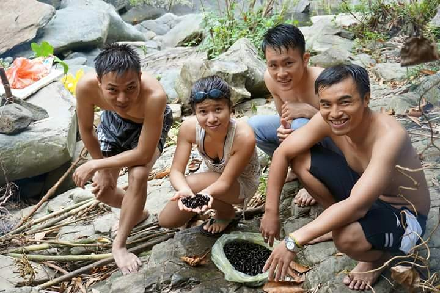
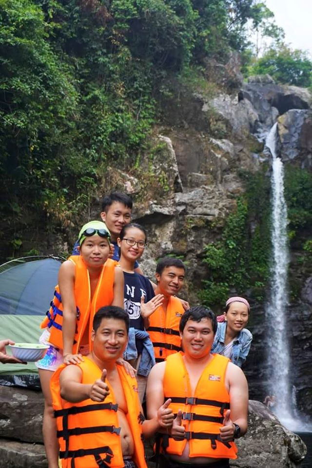
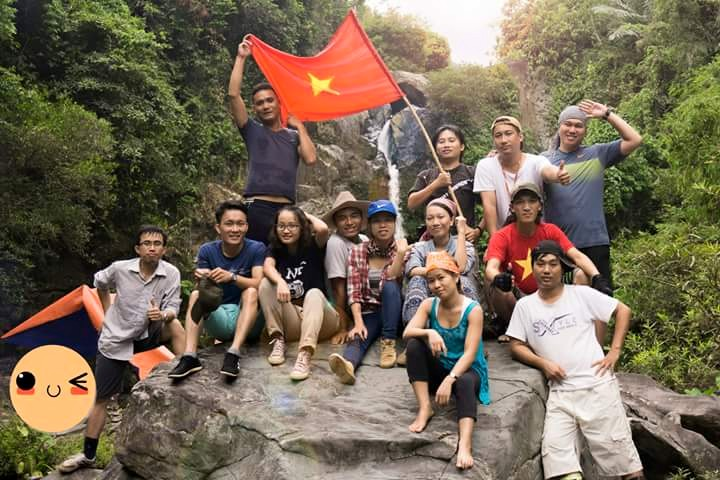
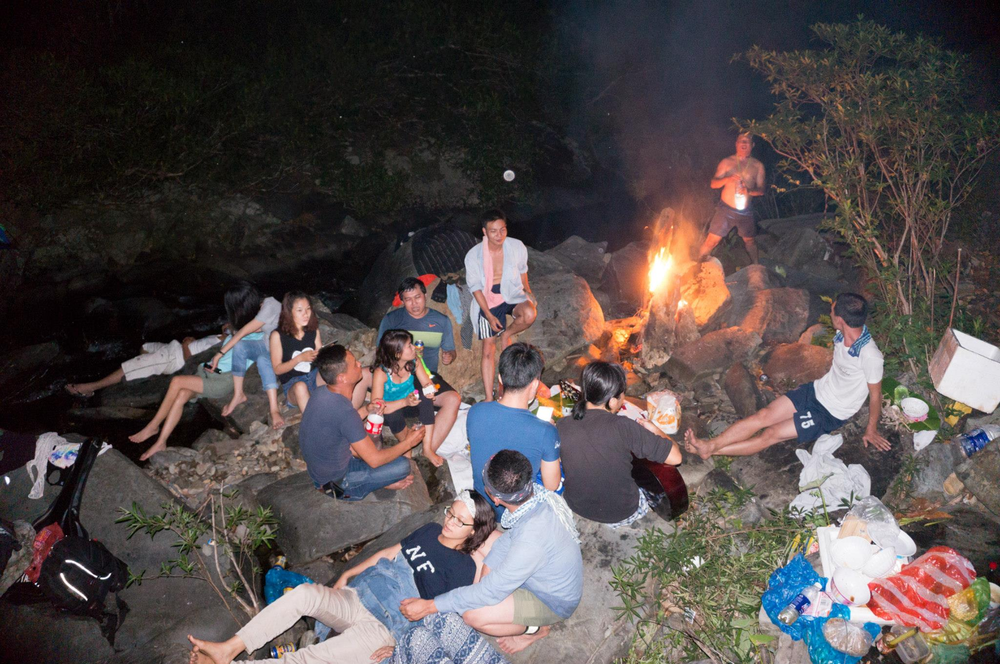

### GIẾNG TRỜI - NGƯỜI VỚI NGƯỜI, QUÁ ĐỖI YÊU THƯƠNG! (Phần mở đầu)

**Phần mở đầu (Phần 1): Lang man, thỉnh thoảng tôi thích thế!**

20-21.06.2015, đó là một chuyến đi ngập tràn cảm xúc.

Tôi đã không định viết gì cả, đã định ích kỉ cá nhân, nằm phịch xuống chiếc nệm êm ái phòng của Quỳnh-Vân và ngủ một giấc thật dài đến tận sáng hôm sau, tự thưởng cho mình thứ cảm giác mà chỉ mới tối qua thôi, tôi xem nó là "xa xỉ".

Bất giác nhớ cô bé nhà văn Lê Nguyễn Nhật Linh từng khẳng định: "Viết, không vội được đâu. Văn ẩu còn nhầu hơn một cái giẻ". Tôi lúc này không hề vội, nói cho rõ hơn là đang rất thong thả nhấm nháp từng mẩu bánh cảm xúc ngọt ngào sau khi trở về từ Giếng Trời. Với tôi, cảm xúc là thứ bộc phát. Muốn thành chữ cũng cần ủi đi ủi lại thật phẳng phiu, không một vết nhăn, không nhàu nhĩ. Bởi nó là thứ chẳng thể gắn tem giá mà tôi luôn may mắn nhặt được sau mỗi chuyến đi.

Lang man một tý. Cứ nghĩ tới nghĩ lui, nghĩ xuôi nghĩ ngược khi viết những dòng này. Nên xưng "tôi", xưng "tui", xưng "mình" hay xưng tên? Nên viết như một kiểu chia sẻ kinh nghiệm trekking Giếng Trời, hay thả mặc xúc cảm ngao du không đầu không cuối? Mà, điều đó có gì quan trọng? Nghĩ gì, thích gì, viết đó. Đơn giản thế thôi!

Có người không chịu tin một đứa học kinh tế, làm kinh tế, lại thích viết nhăng viết cuội đến thế. Họ hỏi: "Những gì em viết, là thật hay là truyện?". Tôi không phải nhà văn, tôi không có khả năng kiếm sống bằng nghề viết lách. Những gì tôi viết, đơn giản chỉ là nhật kí của đời tôi.

10km đi bộ đường rừng. Ghê gớm không? - Ừ, cũng ghê đấy. Phi thường không? - Ừ, có vẻ không phải dạng vừa. Bạn hẳn trả lời thế? Nếu là cách đây năm, mười năm, tôi sẽ giơ hai tay, ngửa nhìn trời và hét thật to: "Bích Thủy đã làm được!". Giờ thì, điều đó không còn "vĩ đại" nữa. Khi con người ta đã bước qua khỏi ngưỡng "nỗi sợ bản thân", thì chẳng còn thấy nó to tát và khủng khiếp. Bích Thủy, chả có gì đáng khen ngợi. "Địa ngục trần gian" ở Hải Vân giữa trưa nắng rát, còn có thể vượt qua được mà.

Lần này, tôi không viết về "chiến tích" bản thân. Tôi đang viết về thứ khác, ngọt và ngất ngây hơn nhiều. Là cảm xúc, là những người bạn đồng hành, tôi chỉ mới gặp ngày hôm qua.

Còn tiếp....(Phần 2: Khi chúng ta đồng lòng, thử thách bị bỏ lại sau mỗi bước chân)

